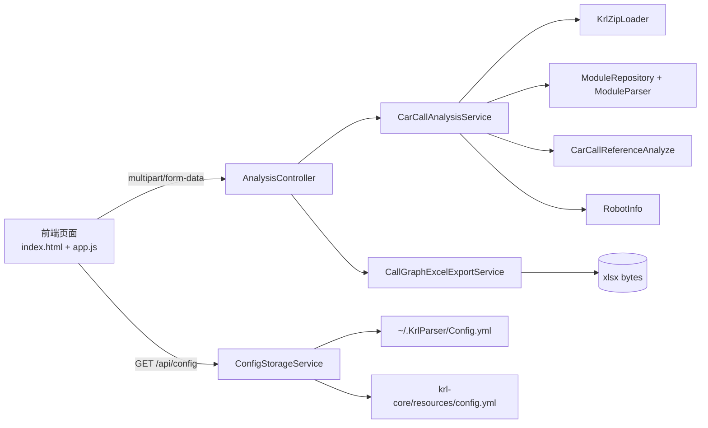

# KRLParser

KRLParser 是一款面向 KUKA 机器人备份包的本地 Web 分析工具，用于解析 KRL 程序并生成调用关系。

它基于以下技术栈：
- `ANTLR4`：KRL 词法/语法解析
- `Spring Boot`：本地服务与接口
- `Cytoscape.js + Dagre`：调用关系可视化
- `Apache POI`：Excel 导出

---

## 1. 目标与定位

针对现场备份包中常见的结构：
`Cell -> P程序 -> 车型代码 -> 车型程序 -> 轨迹程序`，
KRLParser 提供从压缩包读取、规则过滤、语义解析、图谱展示到 Excel 导出的完整闭环。

---

## 2. 新增功能（本次版本重点）

### 2.1 配置文件托管与在线编辑

- 启动时自动检查配置文件路径（默认：`~/.KrlParser/Config.yml`）
- 若不存在，则由 `krl-core/src/main/resources/config.yml` 自动落盘生成
- 前端进入页面后自动拉取当前配置（`GET /api/config`）
- 页面新增 `Config` 按钮，可在线查看/编辑本次分析用配置
- 分析请求时携带 `configText`，无需重复上传配置文件

### 2.2 批量上传备份

- 上传备份支持多选 `*.zip`
- 后端按批量入口统一解析并汇总
- 线体视图展示多个机器人节点（名称取 `RobotInfo.robotName`）
- 点击线体节点进入该机器人对应车型视图

### 2.3 Excel 导出

- 新增 `下载Excel` 按钮，对应接口：`POST /api/analysis/excel`
- 一个线体（一次分析）导出一个 `.xlsx`
- 每个机器人对应一个 Sheet
- Sheet 内包含两部分：
  - 树形调用结构（5 列分层）
  - 调用关系矩阵（行调用方、列被调用方、箭头上溯）

---

## 3. 核心能力

- KRL 备份包解析（zip 内文件遍历、模块聚合、AST 构建）
- 规则过滤（前缀/后缀、白名单/黑名单、大小写不敏感）
- 调用链图可视化
  - 线体信息视图（机器人级）
  - 车型信息视图（调用链级）
  - 单击高亮链路、双击看文件属性、右键看上下文
- Excel 持久化导出（便于归档和跨平台转发）

---

## 4. 系统架构



### 模块分层

- `krl-core`
  - 解析与语义分析核心
  - 调用关系构建与规则引擎
- `krl-web`
  - Spring Boot 启动与 API
  - 配置文件托管
  - Excel 导出
  - 静态前端页面

---

## 5. 目录结构（关键部分）

```text
KRLParser/
├── krl-core/
│   ├── src/main/resources/config.yml
│   └── src/main/java/tech/waitforu/
│       ├── loader/           # zip/yaml 读取
│       ├── parser/           # AST 与调用关系分析
│       ├── rule/             # IgnoreRuleByStr
│       └── service/          # CarCallAnalysisService
├── krl-web/
│   └── src/main/
│       ├── java/tech/waitforu/krlweb/
│       │   ├── controller/   # /api/config /api/analysis /api/analysis/excel
│       │   ├── config/       # ConfigStorageService
│       │   └── service/      # CallGraphExcelExportService
│       └── resources/
│           ├── application.yml
│           └── static/       # index.html + js/app.js + css
└── README.md
```

---

## 6. 快速开始

### 6.1 环境要求

- JDK 21
- Maven 3.9+

### 6.2 本地运行（开发模式）

```bash
mvn -pl krl-web spring-boot:run
```

默认访问：`http://localhost:2026`

### 6.3 打包

```bash
mvn clean package
```

---

## 7. 使用流程

1. 点击 `上传备份(.zip)`，可选择 1~N 个 zip
2. 点击 `Config` 查看/编辑本次分析配置
3. 点击 `开始分析` 查看图谱
4. 在线体视图点击机器人节点进入车型视图
5. 点击 `下载Excel` 导出本次汇总结果

---

## 8. 配置机制说明

### 8.1 配置文件路径

- 默认：`~/.KrlParser/Config.yml`
- 可通过 `krl.config.path` 覆盖

### 8.2 自动初始化

- 若目标路径无配置文件，启动时自动从内置模板复制
- 模板来源：`krl-core/src/main/resources/config.yml`

### 8.3 规则语义

- 规则数组：`prefix` / `suffix`
- `!xxx`：忽略（黑名单）
- `xxx`：保留（白名单）
- `@SKIP@`：跳过该条规则
- 匹配大小写不敏感

### 8.4 关键配置项

- `robotInfo.filePath`：机器人信息 INI 文件路径
- `fileLoadSection`：备份文件加载过滤规则
- `carInvokerParseSection`：调用解析过滤规则

---

## 9. API 说明

### 9.1 读取配置

- `GET /api/config`
- 响应：

```json
{
  "configPath": "/Users/xxx/.KrlParser/Config.yml",
  "content": "...yaml..."
}
```

### 9.2 分析调用关系

- `POST /api/analysis`
- `Content-Type: multipart/form-data`
- 字段：
  - `files`：多个 zip（推荐）
  - `file`：单个 zip（兼容）
  - `configText`：前端编辑后的 YAML 文本
- 返回：`List<RobotInfo>`

### 9.3 分析并导出 Excel

- `POST /api/analysis/excel`
- 入参与分析接口一致
- 返回：`application/vnd.openxmlformats-officedocument.spreadsheetml.sheet`

---

## 10. Excel 设计说明

每个机器人一个 Sheet，结构如下：

1. 树形区（上半区）
- 列顺序固定：`Cell程序 | P程序 | 车型代码 | 车型程序 | 轨迹程序`
- 同层相邻重复值纵向合并
- 类型按固定颜色填充

2. 关系矩阵区（下半区）
- 行 = 调用方，列 = 被调用方
- 若存在直接调用，在交叉单元格填入调用方名称
- 同列顶部到首次直调单元格之间用 `↑` 指示

---

## 11. 常见问题

### 11.1 为什么“下载Excel”按钮不可点击？

前端按钮启用条件为：
- 已选择至少一个 zip
- 配置已成功加载（`/api/config` 成功）

若按钮灰色：
- 检查是否已上传 zip
- 检查后端是否正常启动、`/api/config` 是否返回成功
- 修改 JS 后请强制刷新浏览器缓存（`Ctrl/Cmd + Shift + R`）

### 11.2 配置编辑是长期生效还是临时生效？

- 弹窗内“应用到本次分析”：临时生效（通过 `configText` 传给后端）
- 想长期生效：直接编辑磁盘文件 `~/.KrlParser/Config.yml`

### 11.3 日志在哪里？

默认日志目录：`~/.KrlParser/logs`

---

## 12. 开发建议

- 新增节点类型时，需同步更新：
  - 后端 `NodeType` 与 Excel 样式映射
  - 前端节点样式与筛选面板
- 调整配置规则时，优先通过 `Config` 弹窗快速验证
- 若要扩展导出格式，可在 `CallGraphExcelExportService` 基础上新增策略类

---

## 13. 免责声明

- 解析结果依赖备份完整性与程序规范程度
- 若现场程序包含非常规写法（重复 Case、动态拼接调用等），结果可能存在偏差
- 建议将本工具输出作为工程分析辅助依据，并结合现场逻辑复核
